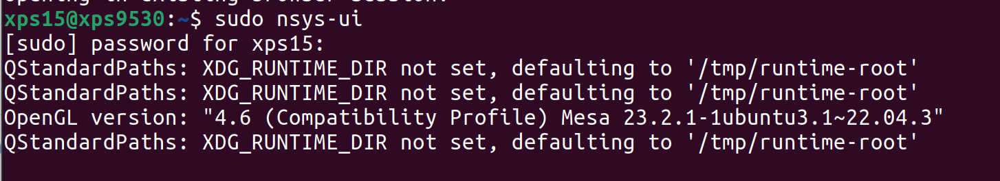
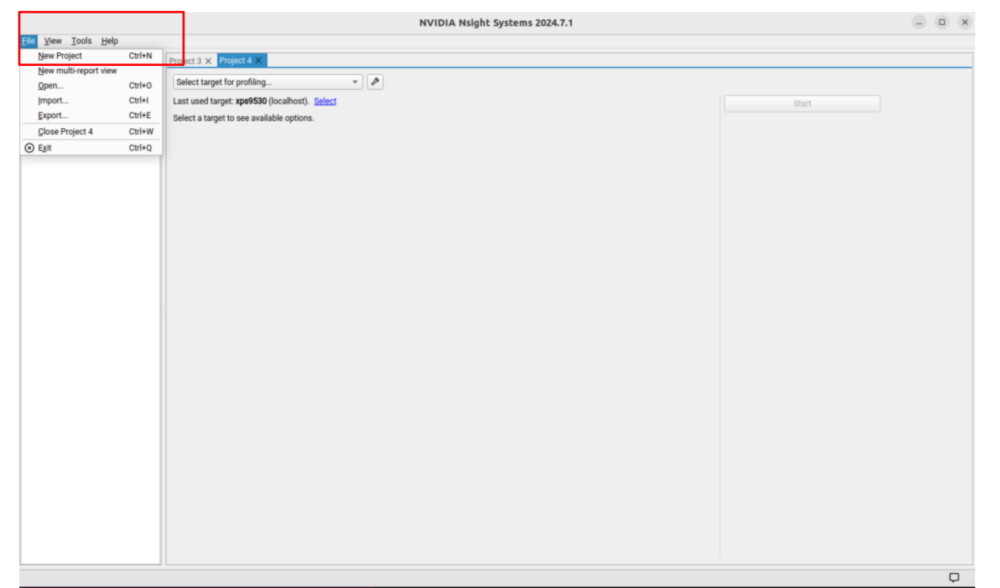
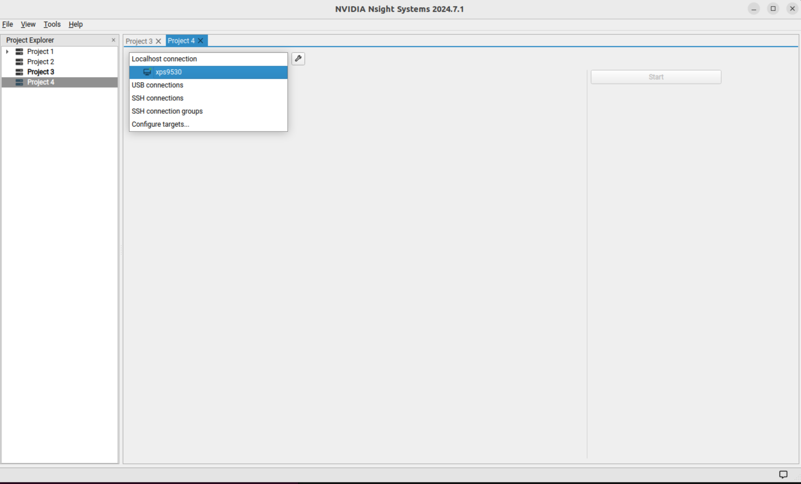
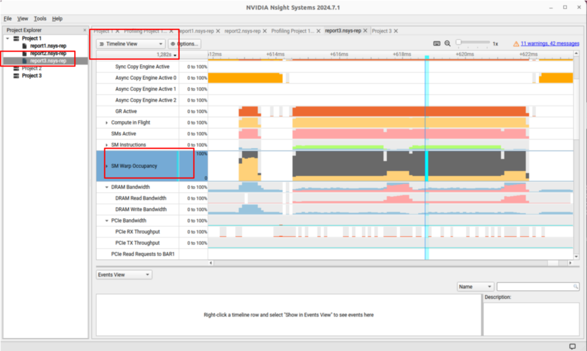

# TensorRT-LLM-Profiling
This repo demonstrates how to use Nsight Systems to profile a TensorRT-LLM model. In this particular example, Nsight Systems will profile an inference workload and renders utilization traces of various components of the GPU, host, and memory.

## Prerequisites
This example requires successful installations of [TensorRT-LLM](https://nvidia.github.io/TensorRT-LLM/index.html)

## Nsight Systems installation
Nsight Systems installation instruction may be found [here](https://docs.nvidia.com/nsight-systems/InstallationGuide/index.html).

## Inference
Inference script for this example is [here](./speculative-decoding.py). This is a Python script. As with all Python applications, it is necessary to execute it from the right virtual environment. However, Nsight Systems is agnostic to the meaning of the virtual environment. Therefore, it expects a full path to the Python executable of the respective virtual environment. As an example, below is the full path to the Python executable:

```
/home/xps15/ai_venv/bin/python3
```

where `ai_venv` is the corresponding virtual environment applicable to this example.

## Launch NSight Systems
The command to launch Nsight Systems in Linux is:

```
sudo nsys-ui
```

and as shown:



After a series of output comments, Nsight Systems should launch as expected.


## Open Profile

Create a project:



DEsignate profile connection:




## Rendering Results

Below shows the time view of the run:


In Project Explorer, select the project of interest.

In the visualization choices, select Timeline View

In the track panel, select SM Warp Occupancy to examine its time traces.

